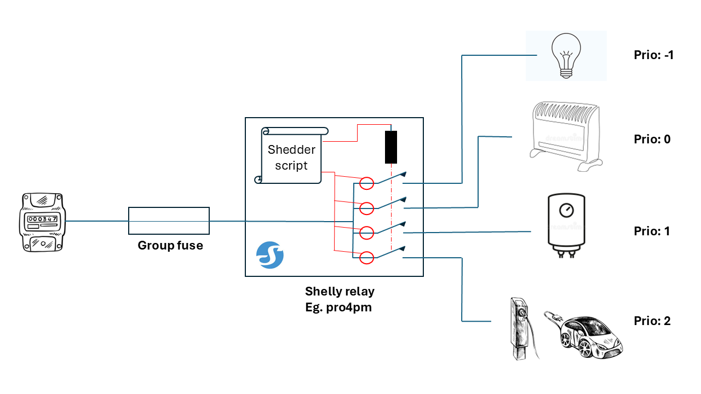
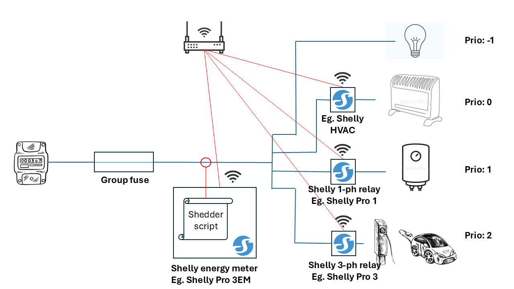
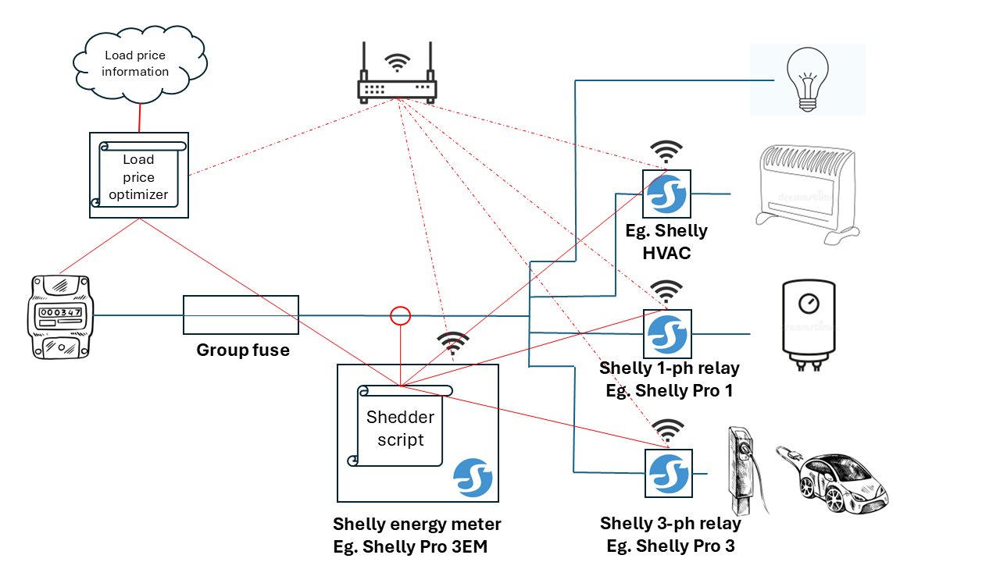

# Shelly load shedder

A general shelly load shedding script

(C) Jonas Bjurel et Al.

License: Apache 2 

## Purpose, principles and use cases:
The purpose of this Shedder script is to provide means to control current drawing through group fuses, grid termination points, etc., such that unnecessary fuse shedding happens or excessive grid costs are avoided.

The shedder script provide means to support multiple use-cases one by one, or in combination.
The script can work in atonomous shedding mode, measuring and shedding channels on the local shelly device it is running on. The script can also control a distributed setup, controlling a set of remote shelly devices.

The shedder script manages a single phase only, 3 separate script instances can be deployed to manage a 3 phase system. If so, there is no coordination between the script instances and the applicability is therefore limited to scenarios where the shelly devices are connected to the same grid phase or to separate grid phases without any cross-phase coupling or restrictions.

### Protecting a single phase group fuse from tripping in atonomous mode.
There are many occations where a group fuse can not be dimentioned for all the potential loads connected to it, this can because the feed cabling is not dimentioned for higher fuse ratings, because of other limitations in the installation, or simply because future load expansions are not foreseen.

*Figure 1. Shelly shedding script in an atonomus shedding configuration.*  
In atonomous mode the script controls the relays on the same shelly device it is running on. Apart from configuration and status updates there is no requirement on network connectivity (Ethernet/WiFi). The current measurement needed for the load shedding decisions are performed locally on the same device that also executes the shedding actions. This provides for a very robust and responsive shedding scheme with short latencies and minimal overhead, making it suitable for real-time applications. A typical autonomous shedding group may look like:

* The last channel (chanel 3) is connected to loads that has the lowest priority and will be disconnected/shedded first and is hence configured with a priority of 2, in this example a car charger . 
* Channel 2, has the next lowest priority and is configured with a priority of 1, in this example it is connected to water heater. 
* Channel 1 has the highest priority among the channels that can be disconnected/shedded and have thus been configured with a priority of 0. In this example it is connected to a heating system. 
* Channel 0 is in this example configured to never disconnect/shed and is in this example connected to loads which you would never want to disconnect: lights, out-lets, refridgerator, stove, ... 

As the group fuse rating gets over-subscribed the loads gets disconnected/shedded in priority order. If for instance the induction stove starts to draw massive amount of current the car charger may be immediately disconnected.

### Protecting a single phase group fuse from tripping in distributed mode.
In case the atonomous mode shedding is not suitable because of the cabling topology, distances, etc. a distributed shedding mode can be applied.

*Figure 2. Shelly shedding script in a distributed shedding configuration.*  
In the distributed shedding mode setup, the shedding script is running on one of the Shelly devices part of the shedding group and interacts with several remote Shelly devices also participating in the shedding group.
Although in theory this setup provides the same functionality as for the atonomous mode - the characteristics is quite different:
* It requires connectivity to work.
* Lost connectivity could lead to unexpected behaviour impacting robustness.
* The latency for measurement and control will be significantly higher than is the case for atonomous mode, leading to longer reaction times.

### Load balancing to avoid excessive grid load.
Another use case is to regulate the load drawn from the grid such that the current is capped below any potential grid provider threshold at which penalty fees apply.

*Figure 3. Shelly shedding script in a grid load-balancing configuration.*  
In this scenario the grid current is reported through the utility meter's HAN port to some kind of automation entity. At currents close to the threshold, the automation entity can request capping of the load through the "current_restriction_setting" API, effectively instructing the shedder to reduce the load such that the total grid current is capped below the threshold.

## Description: 
This current shedding script maintains a load that prevents a single phase group fuse to trip-, 
and provides methods for northbound shedding systems to limit the current load.
Channels defined in "first_to_last_to_shed" are shedded one after one in
priority order. Shedding decisions are based on the group fuse_rating setting,
the group fuse characteristics setting (B,C,D,K,Z), the margin factor, and northbound 
requested current restrictions. 
Shedding decisions are not only based on over-current, but also on the fuse characteristics
for expected trip time or north-bound system set limitatations/restrictions. Shedding 
happens at the time for which the fuse would trip divided by the 
"margin_factor_setting", or instantaneously if the current exceeds north-bound
limitations set by "current_restriction_setting".

Re-loading/loading happens when the previously overloaded group fuse have been cooled 
down for "cool_down_time_setting" seconds, and the previous last good reading for
the disconnected channel in priority will fit within the total group fuse budget.
To avoid non recoverable situations where the previous last good reading is very
high or even exceeds the total group fuse budget due to exceptional events (shorts, 
connection of temporary high load devices, or otherwise), the script will try to 
reconnect a disconnected channel in priority order after "time_to_test_loading_setting "
seconds even if it would seemingly (based on last good reading) over-subscribe the
group fuse current budget.

The script provides a simulation mode where the operation can be simulated by setting
"simulation" to "true" and setting the "simulated_current" channel array to what ever
currents to simulate the behaviour. In simulation mode - the channels will not be switched,
but the expected switch behaviour can be observed as log entries in the console; Note that
log level needs to be set to "LOG_INFO" to observe the operations in simulation mode.

To observe the operations various logging-levels is defined by "LOG_LEVEL", available log 
levels are: "LOG_VERBOSE", "LOG_INFO", "LOG_WARN", "LOG_ERROR", "LOG_CRITICAL".
The logs are available through the local Shelly web-server or through the Shelly cloud service.

## Script configuration (persistant)
This script's behaviour depends on script configuration settings with default values as defined in the
script under "default settings...". The default script configurations are persistantly written to the
shelly KVS (Key Value Store) at the first startup of the script, or after a factory reset of the script/
or the device. The default settings can be changed through the provided Shelly KVS HTTP APIs,
or alternatively setting the KVS store from the shelly local- or cloud- web-page. 
CAUTION: The shelly KVS store is using a storage with limited number of writes (~100 K), limit the number
of programatically initiated re-configurations to ensure adequate life-time of the device.

Following script setting/HTTP APIs are supported (GET):

**Hostname:** 
*http://"ShellyURL"/rpc/KVS.Set?key="hostname_setting"&value=\<hostname>* 
Sets the hostname of the Shelly device, hostname is needed for asynchronous status Webhook reporting.

**Group fuse rating:** 
*http://<"ShellyURL">/rpc/KVS.Set?key="fuse_rating_setting"&value=<fuse_rating [A]>*  
Sets the group fuse rate rating.

**Group fuse characteristics:**  
*http://<"ShellyURL">/rpc/KVS.Set?key="fuse_char_setting"&value=\<"B" | "C" | "D" | "K" | "Z"\>* 
Sets the group fuse characteristics.

**Shedding group settings:**  
*http://<"ShellyURL">/rpc/KVS.Set?key="shed_chan_ptr"&value=[\<key2firstToShed>, \<key2secondToShed>, \<key2thirdToShed>, ...]* 
Sets the KVS key names to where the shedding chnnel definitions are stored, the first channel defined is the first to be shedded, any key name can be used.
The shedding channels are defined as:
Each channel is represented by a JSON object with key:value pairs: 
{addr: <URI|IPaddress|loacalhost>, gen:<shelly_generation>, type: <"relay"|switch|...>, id: <channel_id>, shed: <true|false>, measure: <true|false>  

* **addr**: Defines the IP address of the shelly device to participate in the shedding group. If set to "localhost" the local shelly device (same as the script runs on) is addressed and synchronous calls are made, otherwise asynchronous RPC calls over a layer-3 IP network is used. Remote device access will require network bandwidth and may lead to collisions with other calls on the remote shelly devices, causing  latencies and may call for slightly longer "scan_interval" times (see below).

* **gen**: Defines the shelly device generation.

* **type**: Defines the shelly device type. "relay" indicates a relay that can paticipate in shedding actions, where "meter", "switch", etc.
potentially can participate in providing current measurement to be used by the shedding group.

* **id**: Defines the id/channel of the shelly device (Eg. 4PMPro has four 0-3).

* **shed**: Defines wether the channel is to be used for shedding or not <true | false>.

* **measure**: Defines weather the channel is to be used for group fuse current measurement <true | false>

Obviously, if both "shed" and "measure" is set to false, the channel is redundant and will in no way participate in the shedding group.

The channels can be provisioned through a Web RPC:
*http://<"ShellyURL">/rpc/KVS.Set?key=<"channelKey">&value=Channel JSON object.* 

**Shedding margin settings:**  
*http://<"ShellyURL">/rpc/KVS.Set?key="margin_factor_setting"&value=<margin_factor>* 
Sets the margin factor from for which the theoretical group fuse trip time is divided by 
to determin the actual shedding time.

**Group fuse cool down time:** 
*http://<"ShellyURL">/rpc/KVS.Set?key="cool_down_time_setting"&value=<margin_fator>* 
Sets the group fuse cool down time in secoonds applied after the group fuse have been overloaded until it can be
re-loaded. This time is applied after shedding due to overload happened before it may re-load the fuse, but it is also
rellevant when the fuse was temporarilly re-loaded during a time-period shorter than the shedding time, if the fuse is again
overloaded before the "cool_down_time_setting" timer has expired a shedding event will immediately comence.

**Test loading time:** 
*http://<"ShellyURL">/rpc/KVS.Set?key="time_to_test_loading_setting"&value=\<time_to_test_loading\>* 
Sets Time_to_test_loading, if a shedded channel had a current value before it was shedded that seemingly does not fit the group fuse budget,
the channel will be reconnected after this time. This is to avoid situations where the last known current for some reason was so high that it will (almost) never again fit the group fuse value.

**Script scaning interval:** 
*http:<//"ShellyURL">/rpc/KVS.Set?key="scan_interval"&value=<scan_interval>* 
Sets the scripts scanning interval - meaning the response time for current changes, shedding events, timer-resolution, etc.
While a device that runs this script involving only autonomous operations (not involving other devices) could be set as low as 0.2 seconds,
a system involving other devices may require significantly higher intervals to acommodate for communication resource requirements, latencies,
and otherwise. 

**Maximum current restriction:** 
*http://<"ShellyURL">/rpc/KVS.Set?key="max_current_restriction_setting"&value=<max_current_restriction>* 
The maximum current restriction a north bound shedder system can impose on the shedding group, eg. 
the minimum current it can ask the shedding group to adhere to.

**Current restriction hysteresis:** 
*http://<"ShellyURL">/rpc/KVS.Set?key="current_restriction_hysteresis_setting"&value=<restriction_current_loading_factor>* 
When current restriction from a north bound shedder have caused shedding, re-loading happens when the
expected current load after a channel reconnection is expected to be less than:
"(1-current_restriction_hysteresis_setting) * current_restriction_setting".

**Status webhook end-point:** 
*http://<"ShellyURL">/rpc/KVS.Set?key="status_webhook_uri_setting"&value=<"WebhookURI">* 
Sets the URI endpoint for the shedder status event Webhooks. 

**Log-level:** 
*http://<"ShellyURL">/rpc/KVS.Set?key="log_level_setting"&value=<"LOG_CRITICAL" | "LOG_ERROR" | "LOG_WARN" | "LOG_INFO" | "LOG_VERBOSE">* 
Sets log level.

## Script interaction APIs (non persistant)
This shedder script provides non persistant run-time HTTP APIs that enables interaction with the shedder script and that retreives shedder information as well as asynchronous HTTP Webhook call-backs regarding shedder status changes.

### Setting non persistant properties through HTTP APIs

**Factory reset:** 
*http://"ShellyURL"/script/\<scriptId>/shedder?factory_reset_to_default* 
Resets and restarts the shedder script to factory default. Default settings as defined in the script will persistantly be applied to the KVS store and any custom configurations needs to be applied again as described in
the "Script configuration (persistant)" section above. This method does not reset the shelly device as a whole to factory default, but only the shedder script it self.

Response body: Undefined

**Restart:** 
*http://"ShellyURL"/script/\<scriptId>/shedder?restart* 
Restarts the shedding script, all persistant configurations are retained - but the the internal state machine is re-started, meaning that all shedding events-/states-, over-load-, cooling-, current-restrictions are reset to initial state.

Response body: Undefined

**Current restriction:** 
*http://"ShellyURL"/script/\<scriptId>/shedder?current_restriction=<current>"&validPeriod=<period>* 
A northbound current shedder system may limit the allowed drawn current for this current shedder group.
In contrast to group fuse overloading, current restriction leads to instant shedding when needed.
The "validPeriod" sets the time period in seconds for which the shedder group should adhere to the
current restriction, if the current north-bound curren shedder system has not contacted the shedder group with new instructions within this time the restriction is ceased.

Response body: A JSON object 
{currentRestriction:{result: <"OK"|"NOK">, maximumRestriction:<maximum_current_restriction>}

* **result** - Indicates if the restriction will be fullfilled in its entire or only partially.
* **maximumRestriction** - Indicates the curren lowest current load that a restriction could accomplish.

**Simulation:** 
*http://"ShellyURL"/script/\<scriptId>/shedder?simulation=<true|false> [& turnRelayOnSimulation=<true|false>]* 
Sets or un-sets the shedder script simulation mode. When simulation mode is set, the currents are not measured from the physical channels, but are set by the "simulated_current" API as described below. The relays/switches can also be controlled manually or by other scripts while in simulation mode.
If turnRelayOnSimulation is set to "false" the physical relays are not operated but the intended relay operations can be
observed by log-entries in the Shelly console, or by scanning the the switch state, or by
monitoring the status web-hook event. If turnRelayOnSimulation is set to "true" the relays are operated even if in simulation mode.

Response body a JSON object 
{simulation:true|false, turnRelayOnSimulation:true|false}

**Set simulated current:** 
*http://"ShellyURL"/script/\<scriptId>/shedder?setSimulatedCurrent=<Ch0_current, Ch1_current,
Ch2_current, Ch3_current, ...[A]]>* 
Sets the simulated current for each of the shedder channels.

Response body: A JSON object 
{simulatedCurrent:[ch0_curr, ch1_curr, ch2_curr, ch3_curr,...]}

### Requesting status through HTTP APIs

**measurePerformanceMetrics:** 
*http://"ShellyURL"/script/\<scriptId>/shedder?measurePerformanceMetrics* 
Starts an asynchronous measurement of platform and shedding script system performance for which the results can later be picked-up
by a following "getPerformanceMetricMeasurements" call (see below).

Response body: An informative text string indicating the URL for which the result can be fetched.

**getPerformanceMetricMeasurements:** 
*http://"ShellyURL"/script/\<scriptId>/shedder?getPerformanceMetricMeasurements* 
Fetches the results from a previous "measurePerformanceMetrics" asynchronous request.

Response body: A JSON object 
{performanceMetrics: {metricsUpdated: <true|false>,
                      upTime:<value[s],
                      cpuLoadPerc:<value [%]>,
                      memUsed:<value [B]>,
                      memUsedPerc:<value [%]>,
                      memFree:<value [B]>,
                      memFreePerc:<value [%]>,
                      memHighWatermark:<value [B]>,
                      memHighWatermarkPerc:<value [%]>,
                      totalMem:<value [B]>,
                      overRuns:<value>,
                      measurementBusyCnt:<value>,
                      measurementFailCnt:<value>,
                      measurementTimeoutCnt:<value>}}

* **metricsUpdated:** Indicates if this was the first "getPerformanceMetricMeasurements" call after a successful "measurePerformanceMetrics" call, indicating weather the measurements are fresh/latest or stale from a previous measurement.
* **upTime:** Script uptime in seconds.
* **cpuLoadPerc:** Script portion of device CPU loading in %.
* **memUsed:** Script memory usage in Bytes.
* **memUsedPerc:** Script memory usage in %.
* **memFree:** Device memory free in Bytes.
* **memFreePerc:** Device memory free in %.
* **memHighWatermark:** Maximum ever used memory by Script in Bytes.
* **memHighWatermarkPerc:** Maximum ever used memory by Script in %.
* **totalMem:** Total available device memory in Bytes.
* **overRuns:** Total amount of accumulated overruns, I.e. when a time bound scan of currents, actions, etc cannot be expedited becaus the previous scan has not finished.
* **measurementBusyCnt:** Total amount of accumulated events where the regular current measurements could not be performed because the previous current measurment was still ongoing.
* **measurementFailCnt:** Total amount of accumulated events where the regular current measurements failed.
* **measurementFailCnt:** Total amount of accumulated events where the regular current measurements failed to return within the given time boundary.

**Get current status:** 
*http://"ShellyURL"/script/\<scriptId>/shedder?getCurrent* 
Retrievs the total measured current and current for each channel.

Response body: A JSON object: 
{current:{total: <total_current>, channels:[ch1_curr,ch2_curr,ch3_curr,....]}}

**Get load status:** 
*http://"ShellyURL"/script/\<scriptId>/shedder?getLoadStatus* 
Retrievs the load status for the shedder.

Response body: A JSON object: 
{loadStatus:{loadDirection:<"shedding"|"loading"|"coasting", 
overLoadTimeRemaining:<over_load_time_remaining>,
coolDownTimeRemaining:<cool_down_time_remaining>,
testLoadTimeRemaining:<test_load_time_remaining>,
nextToShed:<next_channel_to-shed>,
lastKnownCurrent:[ch0_curr, ch1_curr, ch2_curr, ch3_curr, ....]
currentRestriction:<current_restriction_setting>}}

* **loadDirection:** shedding - "shedding" of channel(s) is ongoing, "loading" - re-loading of channel(s)
  is ongoing, "coarsing" - no shedding/loading is ongoing.
* **overLoadTimeRemaining** - Time remaining before a shedding will happen (-1 means that there is no overload at hand).
* **coolDownTimeRemaining** - Time before any potential re-loading may happen (-1 means that there is no fuse cooling ongoing).
* **testLoadTimeRemaining** - Time before a test loading will happen despite if it seems not to fit the
group fuse budget.
* **nextToShed** - Next channel to shed if overload so requires.
*  **lastKnownCurrent** - A vector with all channels last known read current, the current could be the
result from a recent reading, but could also be from a reading prior to a channel was shedded.

**Get fuse trip time:** 
*http://"ShellyURL"/script/\<scriptId>/shedder?getTripTime=<current[A]>* 
Requests the calculated group fuse trip time for the specified current and the configured group fuse.
This request does not really request any shedder operational data, but instead invokes the trip-time
calculation routine to give an estimated trip-time.

Response body: A JSON object: 
{tripData:{current:trip_current, tripTime:<trip_time>,
shedMarginFactor:<margin_factor_setting>}}

**Get switch status:** 
*http://"ShellyURL"/script/\<scriptId>/shedder?getSwitchStatus* 
Response body: A JSON object: 
{switchStatus:[
{addr: <URI|IPaddress|loacalhost>, gen:<shelly_generation>2, type: <"relay"|switch|...>, id: <channel_id>, shed: <true|false>, measure: <true|false>, switch_state: <"on"|"off", priority: <prio>}, ...][...]

Each vector element represents a channel in the shedding group, the kv structure is almost identical to that in the "first_to_last_to_shed" script configuration. Two key/value pairs have been added:

* **switch_state** - Indicating if the switch/relay is "on" or "off"
* **priority** - Providing the shedding priority of the shedder channel, in practice the priority
follows the element's order in the vector (0:highest priority - N:lowest priority) 

### Asynchronous status Webhook events.
When the shedder group status changes (shedding/loading) a status webhook can be sent to a HTTP
end-point providing the end-point is defined in the shedder script "status_webhook_uri_setting" configuration.
The web-hook is sent whenever the status is changed, as well as periodically at every minute. 

The webhook is sent to the configured target end-point as a HTTP PUT request: 
*http://<targetEndpointURI>/shedder/\<hostname>/status* 

Request body: A JSON object: 
*{shedderStatus:{hostName: <hostname_setting>, loadDirection: <"shedding"|"loading"|"coasting">
<shedding: <true|false>, nextToShed:<next_channel_to-shed>, fuseProtectionShedding<true|false>, restrictionProtectionShedding:<true|false>, groupFuseCurrent: <current>, groupFuseCurrent: <current>,
channel_current:[ch1_curr,ch2_curr,ch3_curr,ch4_curr,...[A]]}}* 

## Key considerations:
1. Make sure the value set for "fuse_rating_setting" and "fuse_char_setting" 
corresponds to-/or is lesser than the group fuse setting for the shedding group.
2. Set the "margin_factor_setting" to a value grater than 1. If set at 1 the shedding will
happen at the exact moment (or even after) of the expected tripping of the fuse according to IEC 60269.
The shedding time is calculated by the tripping time divided by the "margin_factor_setting",
hence if set to 2 the shedding will happen at half the time from when the fuse tripping 
would happen (provided that the fuse was @ 30 degrees when the overload
happened". 
**A good value is likely between 2-4.**
3. "cool_down_time_setting" defines a fuse quarantine time after overloading for during
which the group fuse needs time to cool down, and no increased loading is allowed. 
**120 to 600 seconds setting is a recommended value.**
4. "time_to_test_loading_setting" defines the time until the disconnected channels in priority
order is re-connected despite that it seemingly does not fit the group fuse budget.
This is needed when a channel momentarily gets overloaded to a level close to- or above the
fuse rating causing the normal loading mechanism to never reconnect the channel. 
**Suggested setting is between 900- and 1800 seconds.**
5. "scan_interval" defines the interval inbetween subsequent measurements/actions. 
**Recommended value is between 0.2 and 1 seconds.**
6. You may have as few as one shedding group channel, but there is no technical upper limit on number of channels. The channels (switches) may be located on the device that this script runs on 
(localhost - autonomous operation), or may be distributed to several devices communicating over
a layer-3 IP network. Please note that the higher numbered entries (4 and 5 here) would be
considered the highest priority - last turned off, and first turned on.
If a measure/shed/load operation relates to a channel local to the shedding script (localhost) it
will be handled synchronously with a neglectable latancy, otherwise asynchronous RPC calls with delays will be used creating latancies reducing the real-time performance and reponse times, in such cases
"scan_interval" may need to be increased to avoid over-runs and unnecessarily worse performance.
7. Current restriction ("current_restricion_setting") is a way for north-bound shedding
systems to ask for a current limitation of this device due to northbound current
contentions. Whenever the current measured through this shedding device is above the
"current_restricion_setting" it will instantly try to shed the current according
to normal priority principles. To avoid oscilations a 
"current_restriction_hysteresis_setting" hysteresis factor is applied before the
re-loading of channels may happen. **A value of 0.1 to 0.2 is recommended**

## Watchdog script
This general purpose watchdog script monitors the health and status of managed scripts and the device itself.
The watchdog script restarts scripts that have stopped running and reboots the device if it becomes unresponsive.
The watchdog script's behaviour depends on script configuration settings with default values as defined in the
script under "default settings...". The default script configurations are persistantly written to the
shelly KVS (Key Value Store) at the first startup of the script, or after a factory reset of the script/
or the device. The default settings can be changed through the provided Shelly KVS HTTP APIs,
or alternatively setting the KVS store from the shelly local- or cloud- web-page. 
CAUTION: The shelly KVS store is using a storage with limited number of writes (~100 K), limit the number
of programatically initiated re-configurations to ensure adequate life-time of the device.

### Watchdog script configuration (persistant)
Following watchdog script setting/HTTP APIs are supported:

**Watchdog configuration:** 
*http://<"ShellyURL">/rpc/KVS.Set?key="watchdog_config"&value=<watchdog_config_json>* 
Sets the watchdog script configuration as a JSON object. The configuration object contains the following parameters: 
{scripts: {<script_name>: null, ...}, httpTimeout: <timeout_seconds>, check_time: <check_interval_seconds>, consecutive_errs: <error_threshold>, log_level_setting: <log_level>}

* **scripts**: A map of script names to monitor (e.g., {"shedder": null}). Script IDs are automatically populated at startup.
* **httpTimeout**: HTTP request timeout in seconds for monitoring operations.
* **check_time**: Interval in seconds between health checks of managed scripts and device responsiveness.
* **consecutive_errs**: Number of consecutive errors before restarting a script or rebooting the device.
* **log_level_setting**: Log level for watchdog output (0=LOG_VERBOSE, 1=LOG_INFO, 2=LOG_WARN, 3=LOG_ERROR, 4=LOG_CRITICAL).

**Example configuration:** 
*http://<"ShellyURL">/rpc/KVS.Set?key="watchdog_config"&value={"scripts":{"shedder":null},"httpTimeout":10,"check_time":10,"consecutive_errs":3,"log_level_setting":1}* 

### Watchdog script interaction APIs (non persistant)
**Get watchdog metrics:** 
*http://"ShellyURL"/script/\<scriptId>/watchdog?watchDogMetrics* 
Retrieves the watchdog health metrics including uptime, error counts, and script restart counts.

Response body: A JSON object 
{watchDogMetrics: {upTime: <seconds>, deviceErrors: <count>, scriptErrors: {<script_name>: <count>, ...}, scriptRestarts: {<script_name>: <count>, ...}}}

* **upTime** - Watchdog script uptime in seconds since startup.
* **deviceErrors** - Number of accumulated consecutive device errors (consecutive unresponsiveness events).
* **scriptErrors** - Map of script names to their accumulated consecutive error counts.
* **scriptRestarts** - Map of script names to their total restart counts.

### Watchdog key considerations:
1. The watchdog script monitors configured scripts at the interval defined by "check_time". A typical value is 10 seconds.
2. Set "consecutive_errs" to define the threshold of consecutive errors before automatic restart or reboot. **A value of 3 is recommended**.
3. If a configured script stops running, the watchdog will restart it after "consecutive_errs" failures have been detected.
4. If the device becomes unresponsive, the watchdog will reboot the device after "consecutive_errs" failures have been detected.
5. The watchdog logs all events and decisions. Adjust "log_level_setting" to control verbosity (0=VERBOSE through 4=CRITICAL). **A value of 3 (LOG_WARN) is recommended for normal operation**.

## Contious integration
The shedder script comes with an extensive automated verification script - "shedder.js" that aims to verify all the aspects of the shedder script in simulated mode. The real current measurement and
relay operations are currently not verified, but needs to be verified manually.

## Contious deployment
There is currently no automated script deployment, at current only agestone copy- and paste mechanisms from github to the actual shelly device exists. The plan is to be able to provide mechanisms to push updates to the device from this repository.
